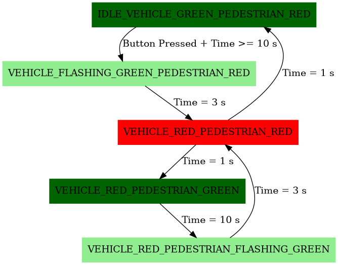

# MCU Traffic Light Controller: Vehicular And Pedestrian

This project implements a traffic light controller, vehicular and pedestrian, with an ATtiny4313 microcontroller programmed in C, using the open-source simulator SimulIDE in GNU/Linux, internal and external interrupts, and a Finite State Machine (FSM).

  * **[Documentation](https://alfonso-caoz.github.io/mcu-traffic-light-controller/html/index.html)** - Project and Firmware detailed information 

> **Concepts and Tools:** ATiny4313 MCU, C, Interrupt Service Routines (ISR), FSM, Timer Pre-scalers, Switch Debouncing, CMake, Doxygen, SimulIDE, GNU/Linux, LEDs, Buttons.

## Traffic Light Finite State Machine (FSM)

<!---

--->

 

## Demo with SimulIDE

<!---
[DemoTrafficLight_Google_Drive](https://drive.google.com/file/d/12pSJ2lb11Bx9yfLRGOzRFmk9PFPUq6HW/view?usp=sharing)
--->

 
https://github.com/user-attachments/assets/fb6c5a24-524d-4db9-94e6-576a4c2691ae

## Pending Work

- [X] Setting Up Tools in GNU/Linux OS
- [X] Circuit Design with SimulIDE
- [X] Firmware in C
- [X] Building with Make file
- [X] Building with CMake: Industry Standard 
- [X] Documenting Firmware and Project with Doxygen
- [X] Documentation Deployment in GitHub Pages: HTML
